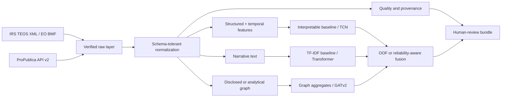

# Form 990 XAI Risk

[](pyproject.toml)
[](LICENSE)

A research-grade, audit-first framework for **interpretable review prioritization** on public IRS Form 990 filings. It combines structured financial features, filing narratives, relationship graphs, longitudinal modeling, weak supervision, unsupervised anomaly discovery, and optional Transformer/GNN/temporal deep learning with built-in explanation outputs.

> **Important boundary:** scores and signals identify records that may deserve human verification. They are not findings of fraud, tax noncompliance, intent, or legal liability. Every consequential conclusion must be checked against the original filing and relevant context.

## Why this repository is different

- **Real public data included:** a small organization-level Form 990 snapshot is checked in for reproducible smoke tests.
- **Official bulk path included:** archive discovery, bounded download, safe ZIP extraction, XML parsing, source hashing, and manifests support full IRS TEOS research.
- **No fabricated benchmark:** the real snapshot has no adjudicated labels, so the repository does not claim predictive performance from it.
- **Explainability by design:** transparent ratios, weak-label reason codes, anomaly deviations, branch probabilities, fusion weights, token attribution, edge attention, and temporal integrated gradients.
- **Leakage-aware evaluation:** organization-grouped stacking and expanding-window tax-year backtesting.
- **Governed outputs:** facts, derived features, weak signals, scores, explanations, and reviewer decisions are kept conceptually separate.

## System architecture



## Implemented capabilities

| Layer | Core, laptop-friendly implementation | Optional research branch |
|---|---|---|
| Acquisition | IRS archive discovery/download; ProPublica API v2 cache and normalizer | Distributed bulk ingestion |
| Parsing | Version-tolerant XML aliases; filings, relations, officers, parser report | More schedule-specific extractors |
| Quality | Duplicate, reconciliation, missingness, history-gap, and coverage audits | Population-specific validation rules |
| Structured | Financial, governance, reconciliation, and temporal features | Gradient-boosted alternatives |
| Text | TF-IDF logistic model with signed token contributions | Pretrained Transformer with token attribution |
| Graph | Transparent one-hop relation features and derived peer graph | GATv2 with edge attention |
| Temporal | Annual ratios, changes, deficit runs, history depth | Dilated residual TCN with integrated gradients |
| Labels | 11 auditable weak-label functions; abstentions and conflicts | Expert-adjudicated labels |
| Unlabeled mode | Isolation Forest with empirical percentiles and robust-z reasons | Self-supervised representation learning |
| Fusion | Grouped out-of-fold stacking and uncertainty routing | Reliability-aware neural fusion |
| Evaluation | Out-of-time metrics, calibration, review-budget metrics, subgroups | Bootstrap intervals and external validation |
| Operations | CLI, manifests, HTML reports, optional FastAPI, Docker, CI, CodeQL | Authenticated case-management integration |

## Quick start: real public snapshot

```bash
python -m venv .venv
source .venv/bin/activate
python -m pip install --upgrade pip
pip install -e '.[dev]'

form990-xai real-sample --output-dir artifacts/real_sample
```

The command produces:

```text
artifacts/real_sample/
├── analytical_relations.csv
├── anomaly_model.joblib
├── anomaly_scores.csv
├── latest_organization_profiles.csv
├── model_frame.csv
├── quality/
├── review_bundle/
│   ├── review_queue.csv
│   ├── review_queue.jsonl
│   └── review_queue.html
├── run_summary.json
├── weak_review_signals.csv
└── weak_supervision_report.json
```

The checked-in snapshot contains 15 organization-year records for three Washington nonprofits and omits person names, addresses, individual compensation rows, and labels. See [`data/real_sample/README.md`](data/real_sample/README.md) and [`docs/REAL_DATA_PROVENANCE.md`](docs/REAL_DATA_PROVENANCE.md).

## Fetch a fresh small real-data cohort

No API key is required by the documented Nonprofit Explorer API v2 endpoint.

```bash
form990-xai fetch-propublica \
  --ein 91-0564748 \
  --ein 91-1935159 \
  --ein 91-0565006 \
  --output-dir data/refresh \
  --build-graph
```

Raw JSON responses are cached before normalization. The fetch manifest records URL, retrieval timestamp, SHA-256, byte count, and cache path.

## Official IRS bulk workflow

```bash
# Discover current archive names from the official IRS page.
form990-xai discover --year 2026 --output artifacts/irs_catalog.json

# Download one bounded archive and verify the ZIP.
form990-xai download \
  --year 2026 \
  --period 06A \
  --output-dir data/raw/irs/2026

# Use a private study-specific secret for stable pseudonymous person IDs.
export FORM990_ENTITY_SALT='replace-with-a-long-random-study-secret'
form990-xai ingest \
  --archive data/raw/irs/2026/2026_TEOS_XML_06A.zip \
  --dataset-name irs-2026-06A \
  --output-dir data/processed/irs-2026-06A
```

Ingestion writes normalized filing, relation, and officer tables; parser diagnostics; a data-quality audit; and a manifest containing raw source hashes and normalized table fingerprints.

## Analytical graph versus disclosed graph

The repository supports two graph concepts that must never be confused:

1. **Disclosed relationship graph:** extracted from filing schedules such as related organizations, officers, and service providers.
2. **Analytical comparison graph:** temporal-predecessor and nearest-peer edges created by code for representation learning.

All analytical edges use `derived_*` relation types and metadata stating that they do not assert affiliation, common control, transactions, or shared personnel.

```bash
form990-xai build-graph \
  --filings data/refresh/filings.csv \
  --neighbors 3 \
  --output data/refresh/relations.csv
```

## Three valid modeling modes

### 1. No labels: anomaly discovery

```bash
form990-xai anomaly \
  --filings data/processed/filings.csv \
  --relations data/processed/relations.csv \
  --save-model artifacts/anomaly.joblib \
  --output artifacts/anomaly_scores.csv
```

An output percentile means “unusual relative to the fitted reference data,” not “noncompliant.”

### 2. No adjudicated labels: weak supervision

```bash
form990-xai weak-label \
  --filings data/processed/filings.csv \
  --relations data/processed/relations.csv \
  --output artifacts/weak_review_signals.csv
```

Every labeling function preserves its vote, abstention, threshold, description, weight, coverage, and conflicts. Weak labels are hypotheses for annotation and sensitivity analysis.

### 3. Human-reviewed labels: supervised research

```bash
form990-xai backtest \
  --filings data/processed/filings_with_review_labels.csv \
  --relations data/processed/relations.csv \
  --min-train-years 3 \
  --review-budget 0.10 \
  --output-dir artifacts/backtest

form990-xai train \
  --filings data/processed/filings_with_review_labels.csv \
  --relations data/processed/relations.csv \
  --model artifacts/risk_model.joblib
```

Labels should be created under a documented, multi-reviewer protocol. See [`docs/LABEL_PROTOCOL.md`](docs/LABEL_PROTOCOL.md) and [`docs/VALIDATION_PLAN.md`](docs/VALIDATION_PLAN.md).

## Optional Transformer + GNN + temporal model

```bash
pip install -e '.[deep]'
```

The optional model contains:

- `TransformerNarrativeModel`: pretrained narrative encoder and gradient × input token attribution.
- `GraphAttentionRiskModel`: GATv2 node classifier and exportable edge attention.
- `TemporalConvRiskModel`: dilated residual temporal convolution and Captum integrated gradients.
- `MultimodalForm990RiskModel`: reliability-aware late fusion returning each branch probability and fusion weight.
- Dataset builders for temporal windows, filing-node graphs, and text records.
- Deterministic training utilities with early stopping and gradient clipping.

See [`docs/DEEP_MODEL.md`](docs/DEEP_MODEL.md) and [`configs/deep_multimodal.json`](configs/deep_multimodal.json).

## Explainability output contract

A review record can contain:

- public filing facts and original source URL;
- derived financial/temporal feature values;
- active weak-label rules and conflicts;
- anomaly percentile and robust deviations;
- supervised branch probabilities and signed contributions, when a validated labeled model exists;
- optional neural token, edge, year-feature, and fusion explanations;
- model version, data fingerprint, thresholds, and interpretation caveat.

Explanations describe model behavior. They do not prove causation or a legal conclusion.

## Testing and reproducibility

```bash
pytest -q
ruff check src tests
python -m build
```

CI tests Python 3.10–3.12, builds the wheel, runs synthetic and real-data smoke workflows, and performs CodeQL analysis. Source downloads and normalized datasets use SHA-256 hashes. Model artifacts receive adjacent checksum manifests.

## Repository layout

```text
src/form990_xai/        Core ingestion, quality, features, models, evaluation, reports, API
src/form990_xai/deep/   Optional Transformer, GATv2, TCN, fusion, datasets, explanations
scripts/                Real-data fetch and reproducible demo entry points
tests/                  Unit, parser, workflow, real-snapshot, and data-client tests
data/real_sample/       Small real public organization-level snapshot with provenance
schemas/                JSON schema contracts
configs/                Synthetic, CI, real-data, and deep-model configurations
docs/                   Architecture, governance, validation, model card, research protocol
notebooks/              Real-data walkthrough
```

## Responsible use checklist

Before any real decision support:

- freeze and fingerprint the cohort;
- verify amendment and tax-period resolution;
- create independently reviewed labels;
- use out-of-time testing and review-budget metrics;
- measure subgroup performance and calibration;
- test explanation stability and usefulness;
- require verification against the original filing;
- record reviewer disposition and provide corrections;
- stop use after material drift or failed validation.

## Documentation

- [Architecture](docs/ARCHITECTURE.md)
- [Real-data provenance](docs/REAL_DATA_PROVENANCE.md)
- [Deep model](docs/DEEP_MODEL.md)
- [Explainability](docs/EXPLAINABILITY.md)
- [Validation plan](docs/VALIDATION_PLAN.md)
- [Benchmark protocol](docs/BENCHMARK_PROTOCOL.md)
- [Governance](docs/GOVERNANCE.md)
- [Threat model](docs/THREAT_MODEL.md)
- [Model card](docs/MODEL_CARD.md)
- [Reproducibility](docs/REPRODUCIBILITY.md)

## License and citation

MIT. See [`LICENSE`](LICENSE) and [`CITATION.cff`](CITATION.cff). Public filing data remain subject to their source terms and provenance requirements.
